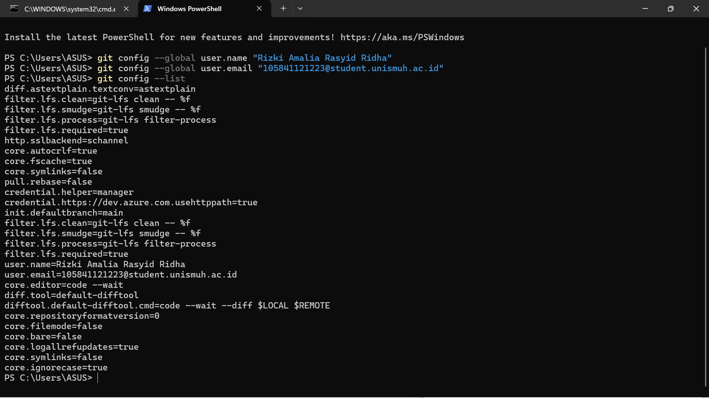
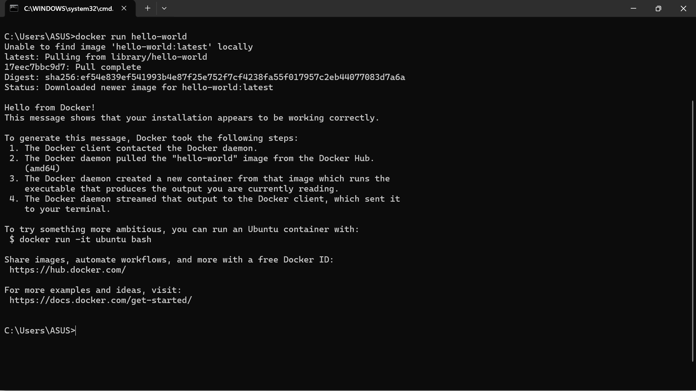
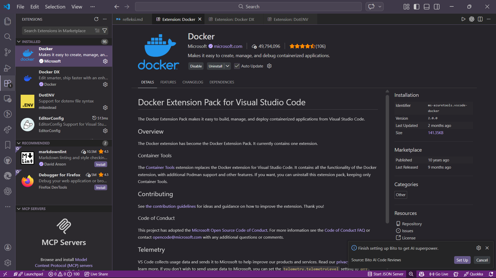
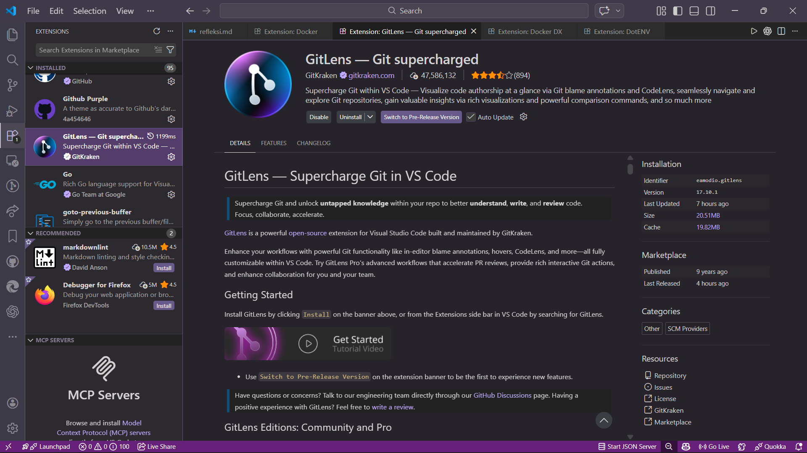
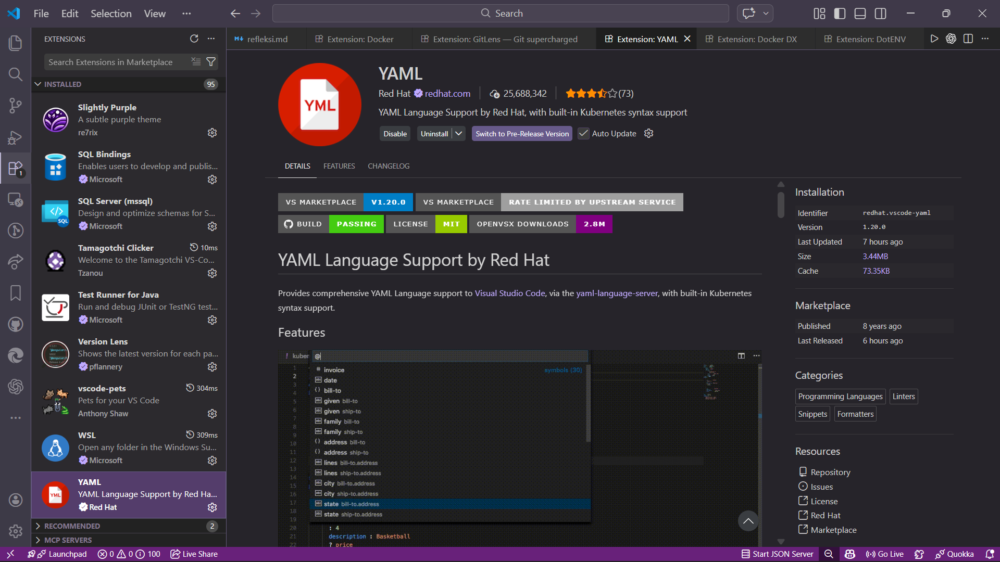
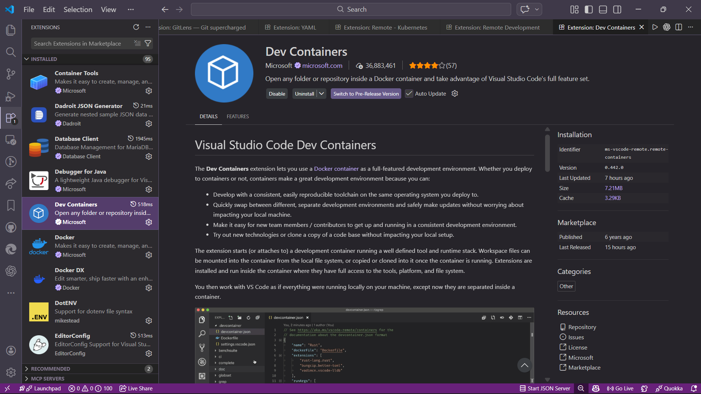

# 🎭 Laporan Praktikum Pertemuan 01
## Pengantar DevOps — Filosofi, Budaya, dan Persiapan Lingkungan
---

## 👤 Identitas Mahasiswa

| Item | Keterangan |
|------|------------|
| **Nama** | Rizki Amalia Rasyid Ridha |
| **NIM** | 105841121223 |
| **Kelas** | 5 B |
| **Tanggal** | 2026-02-24 |
| **Mata Kuliah** | DEVOPS AND CI/CD PIPELINES |
---

## 1. Pemahaman DevOps

**Apa itu DevOps?**
DevOps (merupakan gabungan dari kata *Development* dan *Operations*) pada dasarnya bukanlah sekadar sekumpulan *tools* atau aplikasi, melainkan sebuah filosofi, budaya, dan serangkaian praktik yang bertujuan untuk menyatukan proses pengembangan aplikasi (*Development*) dan operasional TI (*Operations*). Secara tradisional, kedua tim ini sering kali bekerja dalam "silo" atau terpisah; tim pengembang biasanya fokus pada pembuatan fitur baru secepat mungkin, sementara tim operasional fokus pada stabilitas sistem. Hal ini sering memicu kendala operasional dan memperlambat rilis perangkat lunak. Melalui pendekatan DevOps, dinding pemisah tersebut diruntuhkan. Tim bekerja secara terintegrasi sepanjang siklus hidup aplikasi (siklus *infinity loop*), mulai dari fase perencanaan, penulisan kode, pengujian otomatis, hingga *deployment* dan pemantauan metrik secara berkelanjutan.

**Mengapa DevOps penting dalam industri saat ini?**
Penerapan DevOps menjadi sangat krusial dalam industri perangkat lunak modern karena tuntutan pasar yang bergerak dengan luar biasa cepat. Perusahaan dituntut untuk dapat merilis fitur baru, menambal celah keamanan (*patching*), dan memperbaiki *bug* dengan kecepatan dan keandalan tinggi. Dengan mengandalkan pilar CALMS (*Culture, Automation, Lean, Measurement, Sharing*), DevOps mengotomatisasi banyak proses repetitif melalui CI/CD pipelines. Hal ini meminimalisir kesalahan manusia (*human error*), mempercepat waktu rilis (*time-to-market*) dari yang tadinya memakan waktu bulanan menjadi harian atau bahkan per jam, serta memungkinkan pemulihan (*recovery*) yang jauh lebih cepat ketika terjadi kegagalan sistem di lingkungan *production*.

**Contoh Perusahaan yang Sukses Menerapkan DevOps:**
1. **Netflix:** Netflix adalah pionir dalam adopsi DevOps dan *microservices*. Mereka membuat berbagai *open-source tools* untuk mengotomatisasi infrastruktur *cloud* mereka, memungkinkan platform untuk melayani jutaan *streaming* secara bersamaan tanpa gangguan.
2. **Amazon:** Amazon bertransisi dari arsitektur *monolithic* tradisional ke pendekatan DevOps dan *microservices*, yang memungkinkan para teknisinya untuk melakukan ribuan *deployment* setiap harinya secara otomatis dan aman.
3. **Etsy:** Di masa lalu, Etsy mengalami kendala karena proses rilis yang lambat dan penuh konflik. Dengan mengadopsi budaya DevOps, Etsy kini dapat melakukan puluhan *deployment* setiap harinya sambil meminimalisir *downtime*.

---

## 2. Bukti Instalasi (Screenshots)

Berikut adalah lampiran *screenshot* bukti instalasi *development environment* yang telah dilakukan:

### 2.1 Git Version

### 2.2 Git Config

### 2.3 Docker Version

### 2.4 Docker Hello World

### 2.5 VS Code Extensions

