# 🐳 Laporan Praktikum Pertemuan 02
## Docker Fundamentals — Kontainerisasi Aplikasi

---

## 👤 Identitas Mahasiswa

| Item | Keterangan |
|------|------------|
| **Nama** | Rizki Amalia Rasyid Ridha |
| **NIM** | 105841121223 |
| **Kelas** | 5 B |
| **Tanggal** | 2026-02-24 |
| **Mata Kuliah** | DEVOPS AND CI/CD PIPELINES |
---

## 📚 Pemahaman Docker

### Apa itu Docker?

Docker adalah platform perangkat lunak yang memungkinkan pengembang untuk membuat, menguji, dan menerapkan aplikasi dengan cepat menggunakan teknologi kontainerisasi. Kontainer mengemas kode perangkat lunak beserta semua dependensinya sehingga aplikasi dapat berjalan secara konsisten di berbagai lingkungan (development, staging, production) tanpa masalah "works on my machine".

### Komponen Utama Docker

1. Docker Images: Template read-only (tidak dapat diubah) yang berisi instruksi untuk membuat container. Bisa diibaratkan sebagai cetak biru (blueprint) atau resep aplikasi.
2. Docker Containers: Instance yang berjalan (running instance) dari sebuah image. Ini adalah lingkungan terisolasi tempat aplikasi kita benar-benar dieksekusi.
3. Docker Registry: Sistem penyimpanan dan distribusi untuk Docker images, contohnya Docker Hub, tempat kita bisa men-download (pull) image yang sudah ada atau mengunggah (push) image buatan kita.

### Perbedaan Docker vs Virtual Machine

Virtual Machine (VM) mensimulasikan seluruh perangkat keras dan mengharuskan kita menginstal Sistem Operasi Tamu (Guest OS) secara penuh untuk setiap VM, sehingga ukurannya sangat besar (Gigabyte) dan memakan banyak resource. Sebaliknya, Docker Container berbagi kernel yang sama dengan Sistem Operasi Host, sehingga tidak perlu Guest OS. Ini membuat Container jauh lebih ringan (hanya Megabyte), lebih cepat saat dihidupkan (hitungan detik), dan sangat portabel.

---

## 🔧 Praktik Docker Commands

### Output docker ps -a

```
CONTAINER ID   IMAGE          COMMAND                  CREATED         STATUS         PORTS                                     NAMES
64884754c363   nginx:alpine   "/docker-entrypoint.…"   2 minutes ago   Up 2 minutes   0.0.0.0:8080->80/tcp, [::]:8080->80/tcp   web-praktikum
```

### Output docker images

```
REPOSITORY                                TAG                                                                           IMAGE ID       CREATED         SIZE
praktikum-docker                          v1                                                                            0e34bf531350   3 minutes ago   92.5MB
```

### Docker Run Command

```bash
docker run -d -p 8080:80 --name praktikum-web praktikum-docker:v1
```

---

## 📄 Dockerfile

### Isi Dockerfile

```dockerfile
# Gunakan nginx alpine sebagai base image
FROM nginx:alpine

# Copy file HTML ke direktori nginx
COPY app/index.html /usr/share/nginx/html/index.html

# Expose port 80
EXPOSE 80

# Command default nginx
CMD ["nginx", "-g", "daemon off;"]
```

### Penjelasan Dockerfile

FROM nginx:alpine: Menggunakan image resmi Nginx dengan basis OS Alpine Linux. Versi Alpine dipilih karena ukurannya sangat kecil dan ringan, sehingga proses build dan pull image menjadi lebih cepat.

COPY app/index.html /usr/share/nginx/html/index.html: Menyalin file index.html dari dalam direktori app di komputer lokal (host) ke dalam direktori default document root milik Nginx di dalam container. File inilah yang akan ditampilkan saat web server diakses.

EXPOSE 80: Berfungsi sebagai dokumentasi untuk memberitahu Docker bahwa aplikasi di dalam container ini mendengarkan (listen) koneksi masuk pada port 80 (port standar HTTP).

CMD ["nginx", "-g", "daemon off;"]: Mendefinisikan perintah utama yang akan dieksekusi saat container pertama kali dijalankan. Perintah ini menyalakan server Nginx dan memaksanya berjalan di foreground (daemon off;), sehingga container tetap hidup dan tidak langsung berhenti (exit).

---

## 🐙 Docker Compose

### Isi docker-compose.yml

```yaml
version: '3.8'

services:
  web:
    image: nginx:alpine
    ports:
      - "8080:80"
    volumes:
      - ./app:/usr/share/nginx/html:ro
    depends_on:
      - api
    networks:
      - praktikum-net

  api:
    image: httpd:alpine
    ports:
      - "8081:80"
    networks:
      - praktikum-net

  db:
    image: postgres:15-alpine
    environment:
      POSTGRES_USER: praktikum
      POSTGRES_PASSWORD: devops123
      POSTGRES_DB: praktikum_db
    volumes:
      - db_data:/var/lib/postgresql/data
    networks:
      - praktikum-net

networks:
  praktikum-net:
    driver: bridge

volumes:
  db_data:
```

### Penjelasan Docker Compose

version: '3.8': Menentukan versi spesifikasi format Docker Compose yang digunakan.

services: Blok ini mendefinisikan kontainer-kontainer (services) yang akan dijalankan. Terdapat tiga service dalam konfigurasi ini:

1. web (Nginx):

image: nginx:alpine menggunakan image Nginx versi Alpine yang sangat ringan.

ports: - "8080:80" memetakan port 8080 pada komputer host (lokal) ke port 80 di dalam kontainer.

volumes: - ./app:/usr/share/nginx/html:ro melakukan bind mount, yaitu menyalin folder ./app dari host ke folder default Nginx di kontainer. Flag :ro membuatnya menjadi read-only.

depends_on: - api memastikan service web menunggu service api berjalan terlebih dahulu sebelum diinisialisasi.

networks menghubungkannya ke jaringan internal praktikum-net.

2. api (Apache HTTPD):

image: httpd:alpine menggunakan image Apache HTTP Server versi Alpine.

ports: - "8081:80" memetakan port 8081 host ke port 80 kontainer, sehingga bisa diakses secara terpisah dari service Nginx.

networks menghubungkannya ke jaringan praktikum-net yang sama.

3. db (PostgreSQL):

image: postgres:15-alpine menggunakan database PostgreSQL versi 15.

environment digunakan untuk mengatur konfigurasi awal database seperti username, password, dan nama database melalui environment variables.

volumes: - db_data:/var/lib/postgresql/data melakukan mounting menggunakan named volume untuk menyimpan data secara permanen (persistent), sehingga data tidak hilang saat kontainer dihentikan atau dihapus.

networks (praktikum-net): Mendefinisikan jaringan lokal buatan tipe bridge. Ini memungkinkan ketiga service (web, api, dan db) saling berkomunikasi menggunakan nama service mereka sebagai nama host (hostname).

volumes (db_data): Mendefinisikan named volume bernama db_data di level root yang akan dikelola langsung oleh Docker untuk kebutuhan persistensi data service database.

### Output Docker Compose Up

```
time="2026-02-25T01:18:04+08:00" level=warning msg="D:\\TUGAS-PRAKTIKUM\\105841121223_Rizki-Amalia-Rasyid-Ridha_Pertemuan02\\task3-compose\\docker-compose.yml: the attribute `version` is obsolete, it will be ignored, please remove it to avoid potential confusion"
[+] Running 18/18
 ✔ db Pulled                                                                                                                                                                52.6s 
   ✔ 22021ae8a283 Pull complete                                                                                                                                              6.5s 
   ✔ e2808358fab6 Pull complete                                                                                                                                              1.5s 
   ✔ 8b6feeda4732 Pull complete                                                                                                                                              6.9s 
   ✔ 6385d21b1497 Pull complete                                                                                                                                              1.7s 
   ✔ d9fee99ceaeb Pull complete                                                                                                                                             45.6s 
   ✔ 49d5e74d1649 Pull complete                                                                                                                                              1.7s 
   ✔ 1cc5032597da Pull complete                                                                                                                                              1.8s 
   ✔ 2af348483d54 Pull complete                                                                                                                                              1.7s 
   ✔ fbd2333a8b2e Pull complete                                                                                                                                             45.4s 
   ✔ 2b183e31c9f8 Pull complete                                                                                                                                              1.8s 
 ✔ api Pulled                                                                                                                                                               19.3s 
   ✔ 79273eb2147b Pull complete                                                                                                                                              0.8s 
   ✔ 4f4fb700ef54 Pull complete                                                                                                                                              1.7s 
   ✔ 3688fd767e4a Pull complete                                                                                                                                             11.2s 
   ✔ 987f24f891f4 Pull complete                                                                                                                                              1.5s 
   ✔ abd702cd48c8 Pull complete                                                                                                                                              1.7s 
   ✔ b9df760bab4a Pull complete                                                                                                                                             12.3s 
[+] Running 5/5
 ✔ Network task3-compose_praktikum-net  Created                                                                                                                              0.6s 
 ✔ Volume task3-compose_db_data         Created                                                                                                                              0.2s 
 ✔ Container task3-compose-db-1         Started                                                                                                                              5.1s 
 ✔ Container task3-compose-api-1        Started                                                                                                                              5.1s 
 ✔ Container task3-compose-web-1        Started                                                                                                                              4.6s 
```

---

## 📸 Screenshots

| No | Screenshot | Keterangan |
|----|------------|------------|
| 1 | 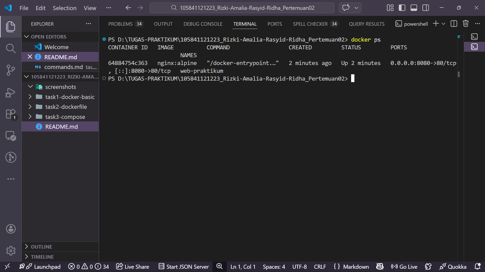 | Container yang sedang berjalan |
| 2 | 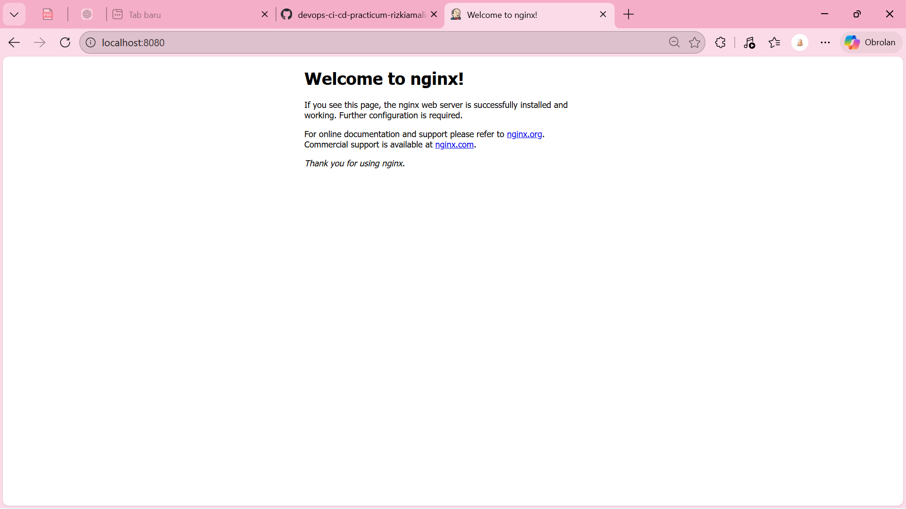 | Nginx berhasil berjalan di web server |
| 3 | 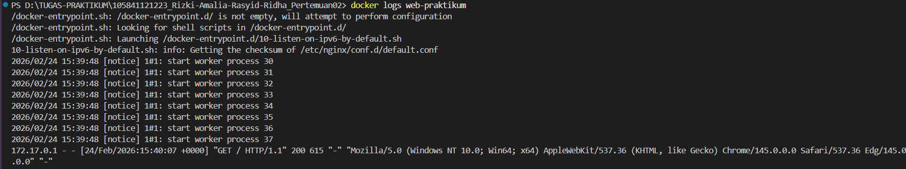 | Output dari command docker logs |
| 4 | 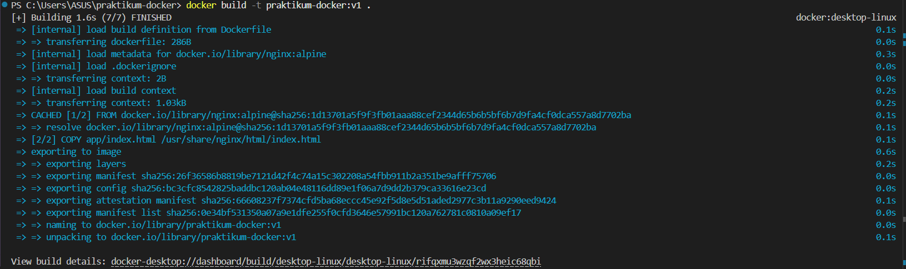 | Proses build Docker image |
| 5 | 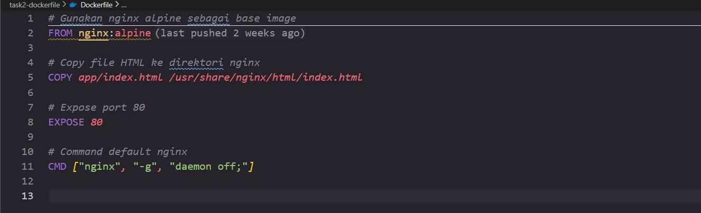 | Isi dari file Dockerfile |
| 6 | 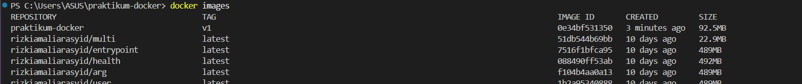 | Daftar Docker images yang tersedia |
| 7 | 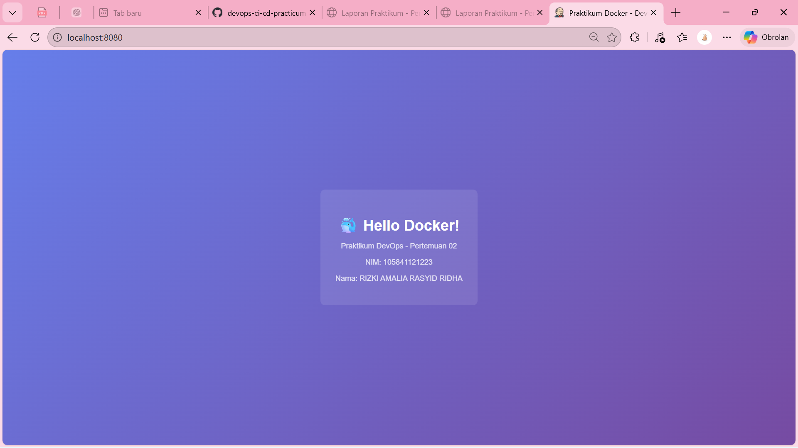 | Tampilan browser hasil deployment custom image |
| 8 | 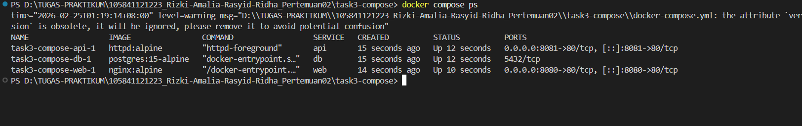 | Status service (Docker Compose ps) |
| 9 | 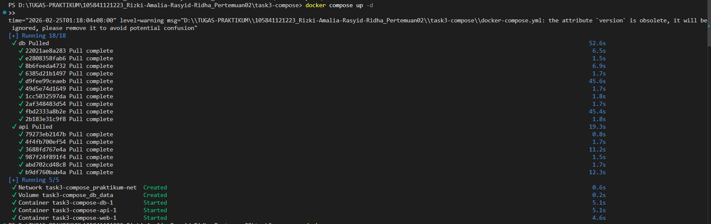 | Proses menjalankan Docker Compose up |
| 10 | 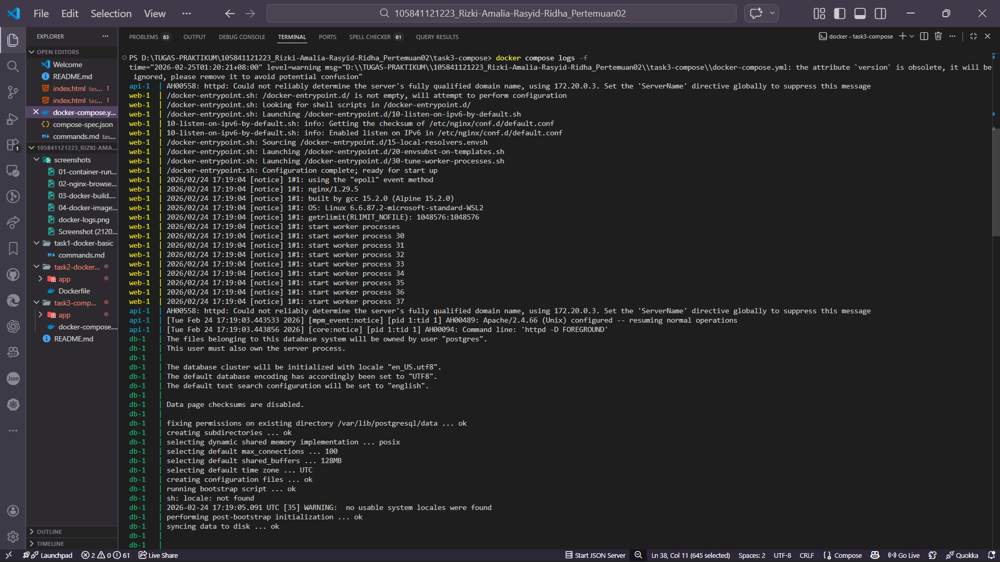 | Output log dari Docker Compose |
| 11 | 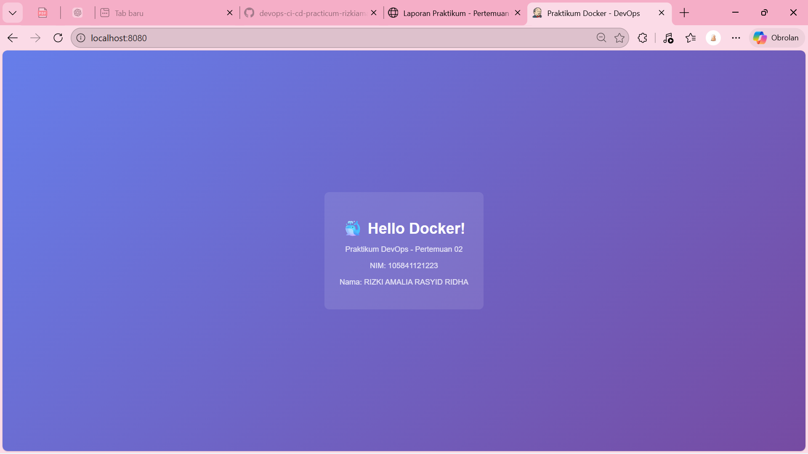 | Aplikasi/services berjalan di browser port 8080(Tab 1) |
| 12 | 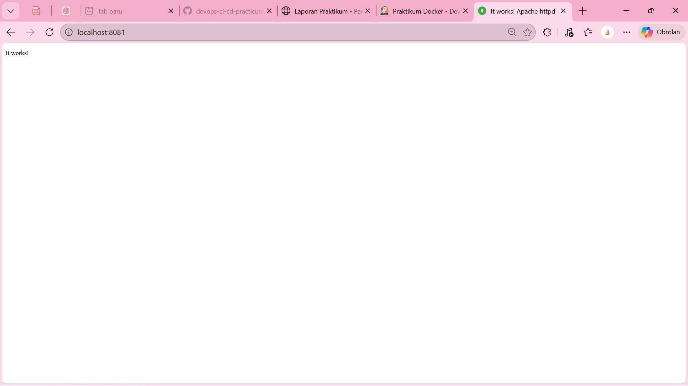 | Aplikasi/services berjalan di browser port 8081(Tab 2) |

---

## 💭 Refleksi & Kesimpulan

### Yang Dipelajari

Dari praktikum ini, saya belajar tentang konsep dasar kontainerisasi dan perbedaannya yang signifikan dengan virtualisasi tradisional (VM), di mana Docker terbukti lebih ringan dan cepat karena berbagi kernel OS host. Saya memahami siklus hidup container dan berlatih menggunakan perintah dasar Docker CLI (seperti pull, run, ps, logs, dan exec). Selain itu, saya juga belajar cara membangun custom image secara otomatis menggunakan instruksi dalam Dockerfile, serta cara mendefinisikan dan mengelola aplikasi multi-container yang kompleks (web, API, dan database) secara bersamaan menggunakan Docker Compose, lengkap dengan implementasi network untuk komunikasi antar-container dan volume untuk persistensi data.

### Manfaat Docker

Docker sangat membantu dalam memecahkan masalah klasik "it works on my machine" karena Docker mengemas aplikasi beserta seluruh dependensi dan konfigurasinya ke dalam satu unit standar (container). Hal ini memastikan aplikasi akan berjalan secara konsisten di lingkungan apa pun (development, testing, maupun production). Selain itu, isolasi yang diberikan Docker mencegah konflik antar dependensi aplikasi di komputer yang sama. Docker juga mempercepat proses onboarding developer baru dan menyederhanakan workflow deployment CI/CD karena infrastruktur direpresentasikan sebagai kode (Infrastructure as Code) melalui Dockerfile dan docker-compose.yml.

### Tantangan dan Solusi

Ada momen di mana container yang baru dibuat langsung berstatus exited dan tidak bisa diakses.

Solusi: Saya menggunakan perintah docker logs [nama_container] untuk melakukan troubleshooting dan melihat pesan error di dalamnya. Ternyata ada kesalahan typo pada nama environment variable (atau penulisan di Dockerfile). Setelah diperbaiki dan image di-build ulang, container berhasil berjalan normal.

---

## ✅ Checklist

- [x] Berhasil membuat Dockerfile yang valid
- [x] Berhasil build Docker image
- [x] Container berjalan dan aplikasi bisa diakses
- [x] Docker Compose berhasil dijalankan
- [x] Semua screenshot lengkap dan jelas
- [x] Penjelasan ditulis dengan bahasa sendiri

---

*Laporan ini dibuat pada Selasa, 24 Februari 2026*


